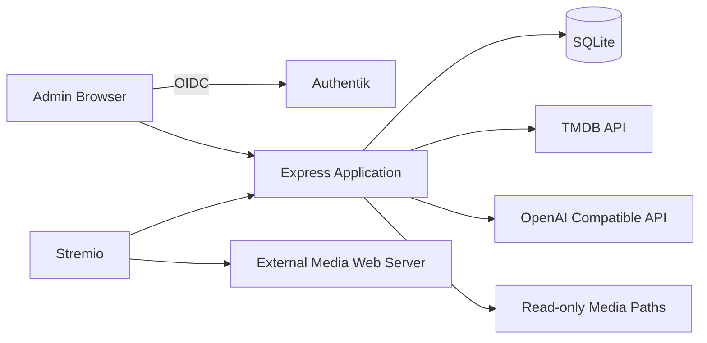

# Personal Media Library for Stremio

A small self-hosted Stremio add-on that scans existing movie, series, episode, and sidecar subtitle files. It matches titles through deterministic parsing, local knowledge, TMDB, and optionally a tightly constrained AI fallback. The add-on returns URLs from an existing public media web server and never modifies media files.

## Features

- Stremio `catalog`, `meta`, `stream`, and `subtitles` resources for movies and series
- Standard IMDb IDs so streams can appear beside Cinemeta content
- Recursive, read-only, incremental scanning with missing-file detection
- Filename parsing for common movie and episode release names
- TMDB candidate scoring, optional AI disambiguation, and AI-assisted fallback searches
- Authentik OIDC-protected React administration UI
- Manual mapping and override protection across rescans
- Match confidence scores and a low-confidence review filter
- SQLite migrations, scan history, request metrics, Docker deployment, and health checks

## Architecture

The application is one Express process serving the add-on protocol, admin API, OIDC callbacks, and compiled React UI. Knex accesses SQLite. Media is streamed by the configured external web server, not proxied by this application.



More design details and assumptions are in [`docs/architecture.md`](docs/architecture.md).

## Requirements

- Node.js 22 or later, or Docker
- An Authentik OIDC application for production administration
- A TMDB API key for automatic and manual metadata resolution
- Media directories mounted read-only where practical
- An HTTP/HTTPS server exposing the same relative directory structure as each configured library

The external media server must support the HTTP behavior required by Stremio, including byte-range requests when needed.

## Configuration

Copy `.env.example` to `.env` and set the required values. The application loads this file automatically for local server and migration commands. Never commit `.env` or any environment-specific variant such as `.env.production`.

| Variable | Purpose |
| --- | --- |
| `NODE_ENV` | `development`, `test`, or `production` |
| `PORT` | Express port, default `7000` |
| `HOST_PORT` | Host port published by Docker Compose, default `7000` |
| `DOCKER_NODE_ENV` | Container mode used by Compose, default `production` |
| `IMAGE_TAG` | GHCR image version used by Compose, default `v0.1.1` |
| `MEDIA_HOST_PATH` | Host media directory mounted by Compose, default `/mnt/media` |
| `MEDIA_CONTAINER_PATH` | Read-only media path visible inside the container, default `/media` |
| `DATABASE_URL` | SQLite path, default `./data/app.db` |
| `PUBLIC_ADDON_URL` | Public origin of this application, without `/manifest.json` |
| `ADMIN_ORIGIN` | Vite Admin UI origin in development, default `http://localhost:5173` |
| `SESSION_SECRET` | At least 32 random characters used to sign sessions |
| `OIDC_ISSUER_URL` | Authentik provider issuer URL |
| `OIDC_CLIENT_ID` | OIDC client ID |
| `OIDC_CLIENT_SECRET` | OIDC client secret |
| `OIDC_REDIRECT_URI` | Exact callback URL, normally `https://host/auth/callback` |
| `TMDB_API_KEY` | TMDB v3 API key |
| `AI_ENABLED` | Enables AI candidate selection when set to `true` |
| `OPENAI_BASE_URL` | OpenAI-compatible API root ending in `/v1` |
| `OPENAI_API_KEY` | OpenAI-compatible API key |
| `OPENAI_MODEL` | Model name accepted by the configured service |

OIDC is mandatory when `NODE_ENV=production`. In development only, an intentionally explicit local administrator session is used when OIDC is not configured.

Generate a unique production session secret rather than using the placeholder from `.env.example`:

```bash
openssl rand -base64 48
```

## Local Development

```bash
npm install
cp .env.example .env
npm run db:migrate
npm run dev
```

Open `http://localhost:5173/admin/` for the Vite development UI. The Stremio manifest is available from `http://localhost:7000/manifest.json`.

On macOS, AirPlay Receiver may already use port `7000`. If `/health` returns `403 Forbidden` or startup reports `EADDRINUSE`, set `PORT=7001`, update `PUBLIC_ADDON_URL` and `OIDC_REDIRECT_URI` to port `7001`, and use `http://localhost:7001/manifest.json`. The Vite proxy reads `PORT` from `.env` automatically.

Useful commands:

```bash
npm run dev
npm run build
npm run start
npm run test
npm run lint
npm run db:migrate
```

## Docker Deployment

1. Create `.env` and use production HTTPS URLs.
2. Set `MEDIA_HOST_PATH` and `MEDIA_CONTAINER_PATH` in `.env`.
3. Ensure the Docker daemon can create or access `./data`; the container entrypoint initializes its ownership on first startup.
4. Start the application.

```bash
mkdir -p data
docker compose pull
docker compose up -d
```

Compose pulls `ghcr.io/rasooll/stremio-personal-library:${IMAGE_TAG}` and defaults to the pinned `v0.1.1` release. Set `IMAGE_TAG=latest` only when automatic feature updates are preferred over a fixed release. The published image supports `linux/amd64` and `linux/arm64` and includes SBOM and provenance attestations.

Compose keeps the application port inside the container at `7000` and publishes it as `HOST_PORT`. It also overrides `DATABASE_URL` with the unambiguous container path `/app/data/app.db`, backed by the `./data:/app/data` volume. For example, this local macOS configuration avoids the AirPlay port conflict:

```env
HOST_PORT=7001
MEDIA_HOST_PATH=/Volumes/MyMedia
MEDIA_CONTAINER_PATH=/Volumes/MyMedia
PUBLIC_ADDON_URL=http://localhost:7001
OIDC_REDIRECT_URI=http://localhost:7001/auth/callback
```

Production is the default Compose mode and requires OIDC. For local-only Docker testing without OIDC, set `DOCKER_NODE_ENV=development`; do not expose that development deployment to an untrusted network.

The release image can also be pulled directly:

```bash
docker pull ghcr.io/rasooll/stremio-personal-library:v0.1.1
```

Runtime secrets are never embedded in the image. Supply each deployment's unique `.env` values through Compose or `docker run --env-file .env`.

On startup, the container creates `/app/data` when needed, fixes only that volume's ownership, and then drops privileges to the unprivileged `node` user before starting the application. This allows SQLite to create its database on a fresh bind mount without running the application as root.

The path entered in the Admin UI is the path visible **inside the container**. With these values:

```env
MEDIA_HOST_PATH=/mnt/media
MEDIA_CONTAINER_PATH=/media
```

a host file at `/mnt/media/movies/Example.mkv` is configured with a local library path such as `/media/movies`. The host and container paths do not need to match. Existing database library paths must start with `MEDIA_CONTAINER_PATH`; using the same host and container path is also valid.

Terminate TLS at a reverse proxy and forward the original protocol. Express trusts one proxy hop so secure session cookies work behind that proxy. The public Stremio URL must use HTTPS except for localhost development.

To build locally instead of using GHCR:

```bash
docker build -t stremio-personal-library:local .
```

## Authentik OIDC Setup

1. In Authentik, create an OAuth2/OpenID Provider using Authorization Code flow.
2. Set the redirect URI to the exact value of `OIDC_REDIRECT_URI`, for example `https://stremio.example.com/auth/callback`.
3. Use a confidential client and record its client ID and secret.
4. Ensure the `openid`, `profile`, and `email` scopes are available.
5. Create an Authentik Application using that provider and grant access to the intended administrator.
6. Set `OIDC_ISSUER_URL` to the provider issuer shown by Authentik. It commonly resembles `https://auth.example.com/application/o/stremio-library/`.
7. Set the client ID, client secret, callback URL, and a strong `SESSION_SECRET`, then restart the application.

The server uses discovery, Authorization Code flow, PKCE, state, nonce, validated ID-token claims, server-side sessions, and `HttpOnly`, `SameSite=Lax` cookies. Session cookies are `Secure` whenever `PUBLIC_ADDON_URL` uses HTTPS. Production HTTP is rejected except for loopback-only testing. Access tokens are not stored in browser storage, and callback query parameters are omitted from request logs.

## TMDB and AI Matching

Create a TMDB API key at [themoviedb.org](https://www.themoviedb.org/settings/api) and set `TMDB_API_KEY`. Matching follows this order:

1. Exact unchanged file fingerprint
2. Existing known folder mapping
3. Deterministic filename and path parsing
4. Existing local media metadata
5. TMDB search with title/year scoring
6. Optional AI selection among supplied TMDB candidates
7. Optional AI title/year correction followed by one additional TMDB search
8. Unresolved manual review

AI is disabled by default. When enabled, it receives only the filename, parent names, parsed fields, and a compact candidate list. It may select only a supplied candidate ID. If the initial TMDB search is insufficient, AI may propose a better title and year for one additional TMDB search, but it can never provide the final TMDB or IMDb ID. Invalid, timed-out, invented, or below-threshold responses are rejected.

AI matches require at least 65% confidence. Accepted mappings retain their confidence score, and the Admin UI highlights and filters scores below 85% under **Content > Low confidence**. The Dashboard also shows the current low-confidence count.

## Adding and Scanning a Library

1. Sign in at `/admin`.
2. Open **Libraries** and enter a name, local path, and public base URL.
3. The local path must exist inside the application/container.
4. The public URL must expose the same relative hierarchy.
5. Select **Update** to start an incremental scan.
6. Follow progress and external request counts under **Scan History**.

Example:

```text
Local library: /media/tv
Public URL:    https://files.example.com/tv
Local file:    /media/tv/Breaking Bad/Season 01/Episode 01.mkv
Stream URL:    https://files.example.com/tv/Breaking%20Bad/Season%2001/Episode%2001.mkv
```

Unchanged files are skipped before parsing or metadata lookup. A second unchanged scan performs zero media analyses, zero TMDB identification requests, and zero AI requests. Files absent after a successful directory walk are marked missing. Deleting a library removes database records only.

## Manual Corrections

Open **Unresolved** or **Content**, select a file, and enter an IMDb or TMDB ID. TMDB verifies the identifier and retrieves canonical metadata. Series files also accept season and episode values; subtitle records accept a language code.

Manual mappings are locked and survive rescans. **Re-run automatic matching** discards the current automatic or manual database mapping and marks the file for matching during the next library update. This explicit action preserves the guarantee that an ordinary unchanged scan performs no metadata or AI work. Confirmation is required before rematching and library deletion. No action modifies a media file.

## Installing in Stremio

After at least one matched scan, install:

```text
https://stremio.example.com/manifest.json
```

The add-on exposes **My Movies** and **My Series** catalogs. It also responds to standard IMDb movie IDs and `{series_imdb_id}:{season}:{episode}` episode IDs, allowing its streams to appear for matching content supplied by Cinemeta.

## Health and Operations

`GET /health` returns only basic process/database state:

```json
{"status":"ok","database":"ok"}
```

Only one scan runs at a time. A scan left running during process termination is marked interrupted on the next startup. Structured request logs redact authorization and cookie headers.

## Publishing Safely

The repository is designed to keep runtime state and credentials out of Git:

- `.env`, `.env.*`, `.envrc`, `.direnv/`, `.npmrc`, private key files, `secrets/`, and `credentials/` are ignored.
- `.env.example` contains placeholders only and is intentionally tracked.
- SQLite databases, WAL files, logs, build output, coverage, and media data are ignored.
- `package.json` is marked `private` to prevent accidental npm publication.
- Docker excludes the same credential files from its build context.

Before making a fork or repository public, run:

```bash
git status --short
git ls-files | grep -E '(^|/)(\.env($|\.)|.*\.(pem|key|p12|pfx|db|sqlite|sqlite3)$)'
npm audit
```

The second command should print nothing except `.env.example`. If a real credential was ever committed, removing it from the latest commit is not sufficient: revoke it first, then purge it from the full Git history before publishing.

## Database Backup

SQLite uses WAL mode. For a consistent online backup, use SQLite's backup command against the mounted database:

```bash
sqlite3 data/app.db ".backup 'data/app-backup.db'"
```

Alternatively stop the application and copy `app.db` together with any `app.db-wal` and `app.db-shm` files. Server-side sessions are stored in the same database.

## Troubleshooting

- **Admin redirects repeatedly:** verify issuer, exact callback URI, reverse-proxy HTTPS headers, and Authentik application access.
- **Library path does not exist:** use the path visible inside the process/container, and check mount permissions.
- **Streams return 404:** verify the public base URL and that the external web server mirrors the library's relative paths.
- **Playback cannot seek:** enable byte-range support on the external media web server.
- **Everything is unresolved:** configure `TMDB_API_KEY`, inspect parsed fields in **Unresolved**, and verify filename/folder naming.
- **A previously unresolved file is unchanged:** select it in **Unresolved**, choose **Re-run automatic matching**, then update its library.
- **Low-confidence matches need review:** use **Content > Low confidence**, edit incorrect mappings, and verify their IMDb or TMDB IDs.
- **AI request count is unexpectedly high:** check that episodes share a stable show folder and that the first episode established a confident series match.
- **SQLite is locked:** run only one application instance against the database and ensure the data directory is on a filesystem suitable for SQLite.

## Future PostgreSQL Migration

Business queries use Knex and SQL-specific setup is contained in the database/migration modules. A future migration should add a PostgreSQL connection configuration and adjust SQLite-only pragmas and migration details. PostgreSQL infrastructure is intentionally not included now; one SQLite-owning application instance is the supported deployment model.

## License

This project is available under the [MIT License](LICENSE).
