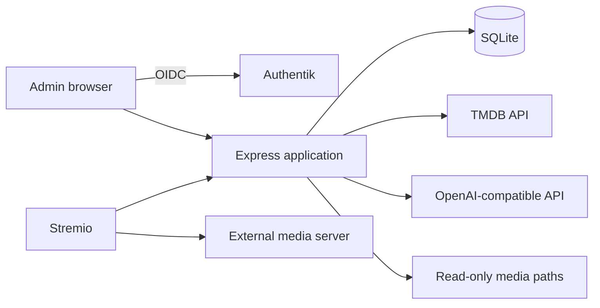

# Architecture

The application is one Node.js process. Express serves the public Stremio add-on, authenticated admin APIs, OIDC callbacks, and the compiled React UI. Knex accesses one SQLite database. The scanner reads configured directories directly and stores file state and media mappings. Stream and subtitle URLs point to the separately configured public media server; this application never proxies or modifies media files.

## Design Decisions

- A cheap fingerprint of library ID, relative path, size, and modification time controls incremental work. Unchanged files do not enter the matching pipeline.
- Manual mappings use a `manual_override` flag and are never replaced by scanning. Re-running automatic matching is an explicit admin action.
- A scan is a mark-and-sweep operation. Files are marked seen only after discovery; unseen records become missing only after a successful directory walk.
- Series metadata is stored once. Episodes remain file mappings with season and episode numbers.
- Sidecar subtitles are ordinary file records mapped to the same media and episode as their unambiguous video stem.
- TMDB candidates are scored deterministically. AI can only select an ID from supplied candidates; when needed, it may suggest a title and year for one additional TMDB search but cannot introduce metadata identifiers.
- One in-process scan manager serializes all scans. Running scans are marked interrupted during startup.

## Assumptions

- One application instance owns the SQLite database. SQLite is not a coordination mechanism for multiple replicas.
- Public media URLs support the HTTP behavior needed by Stremio, including byte-range requests where required.
- Local library paths are paths visible inside the running process or container, not necessarily host paths.
- Symlinks are not followed. This avoids loops and escaping a configured library root.
- OIDC is required for admin routes in production. Development may use an explicit local bypass when OIDC is not configured.
